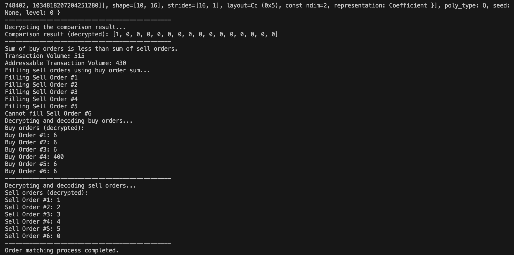
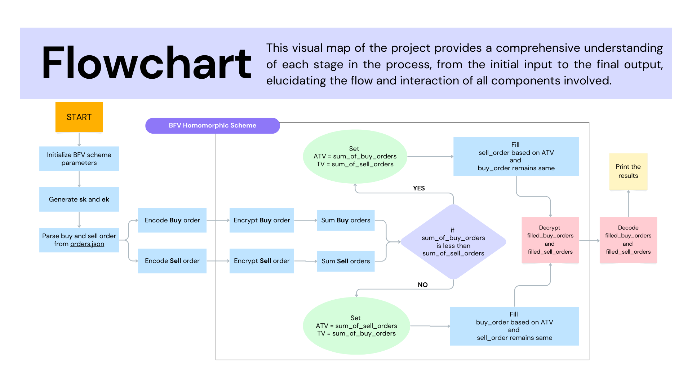

# BFV Homomorphic Order Matching Engine

## Overview
The BFV Homomorphic Order Matching Engine is a Rust-based project that demonstrates the use of homomorphic encryption for secure and privacy-preserving order matching in financial trading systems. The project utilizes the BFV (Brakerski-Fan-Vercauteren) encryption scheme to perform computations on encrypted order data without revealing the underlying values.

## Problem Statement
In traditional order matching systems, sensitive order information, such as buy and sell order values, is processed and matched in plaintext. This poses privacy and security risks, as the order data is exposed to potential breaches and unauthorized access. Additionally, the lack of confidentiality may hinder the participation of certain entities in the trading system.

## Solution
The BFV Homomorphic Order Matching Engine addresses these challenges by leveraging homomorphic encryption. The project enables secure order matching while preserving the confidentiality of the order data. The key features of the solution include:

- **Encryption**: Buy and sell orders are encrypted using the BFV encryption scheme, ensuring that the order values remain confidential throughout the matching process.
- **Homomorphic Operations**: The engine performs homomorphic addition and comparison operations on the encrypted order data. This allows for the matching of buy and sell orders without decrypting the values.
- **Secure Matching**: The engine determines the transaction volume based on the encrypted sums of buy and sell orders. It then fills the orders based on the available volume while maintaining the confidentiality of the order values.
- **Decryption**: The filled orders are decrypted and decoded only at the end of the process, revealing the matched orders and their respective values to the authorized parties.

## Demo
Here's a sample output of the BFV Homomorphic Order Matching Engine:


In this example, the engine successfully matches the buy and sell orders while keeping the order values encrypted during the process. The filled orders are decrypted and displayed at the end, showing which orders were matched and their corresponding values.

## Flow-Chart


## Getting Started
To run the BFV Homomorphic Order Matching Engine, follow these steps:

1. **Clone the repository**:
    ```sh
    git clone https://github.com/Giri-Aayush/bfv-homomorphic-order-matching-engine.git
    ```

2. **Install Rust and Cargo** (if not already installed):
    Follow the instructions at [rust-lang.org](https://www.rust-lang.org/).

3. **Navigate to the `caird/operators` directory and buil package**:
    ```sh
    cd bfv-homomorphic-order-matching-engine/caird/operators
    cargo build
    ```
4. **Navigate to the `bfv` directory and build package**:
    ```sh
    cd bfv-homomorphic-order-matching-engine/bfv
    cargo build
    ```

7. **Navigate to the `order-match-engine` directory and build project**:
    ```sh
    cd bfv-homomorphic-order-matching-engine/order-match-engine
    cargo build
    ```

9. **Run the engine**:
    ```sh
    cd bfv-homomorphic-order-matching-engine/order-match-engine
    cargo run
    ```

Make sure to have the necessary dependencies installed and the `order.json` file in the `order-match-engine` directory, containing the buy and sell orders in the specified format. The output of the order matching process will be displayed in the console.
