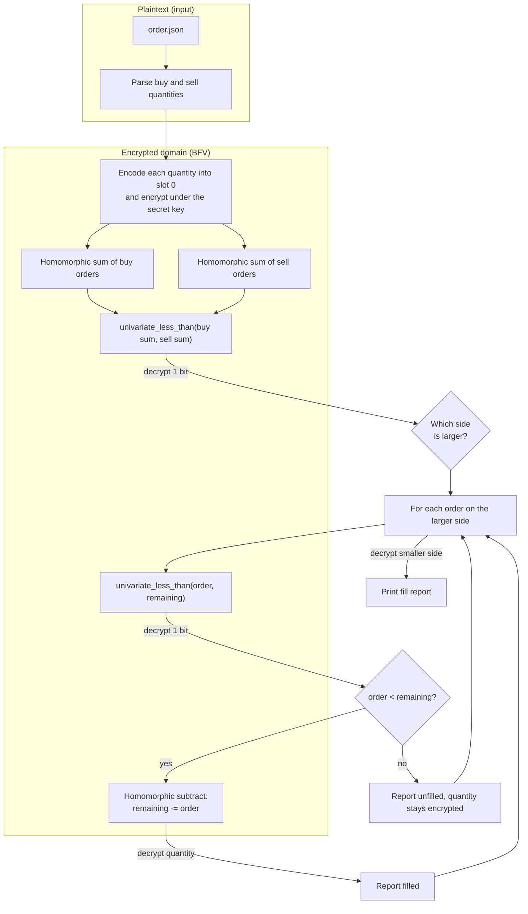

# BFV Homomorphic Order Matching Engine

[](https://github.com/Giri-Aayush/bfv-homomorphic-order-matching-engine/actions/workflows/ci.yml)

Exchanges that see order flow can exploit it: front-running, information leakage from dark pool operators, and MEV extraction all stem from a matching engine that reads orders in the clear. This project explores the alternative, a matching engine written in Rust that performs its arithmetic (order aggregation, running volume, less-than comparisons) on BFV-encrypted order quantities, so the arithmetic of matching never touches a plaintext quantity.

One caveat up front, stated precisely in [What is encrypted and what is revealed](#what-is-encrypted-and-what-is-revealed): this is a single-party demonstration. Comparison results are decrypted at each decision point to drive control flow, so the process is not zero-knowledge end to end. The homomorphic circuits themselves (sums, subtraction, and a degree-65536 comparison polynomial) are real and tested.

## Quickstart

```sh
git clone https://github.com/Giri-Aayush/bfv-homomorphic-order-matching-engine.git
cd bfv-homomorphic-order-matching-engine/order-match-engine
cargo run --release
```

Requires a Rust toolchain with edition 2024 support (Rust 1.85 or later). With no argument the engine reads `order-match-engine/order.json`, the toy book used throughout this README:

```json
{
  "pair": "USDC/USDT",
  "buy_orders": [6, 6, 6, 6, 6, 6],
  "sell_orders": [1, 2, 3, 4, 5, 6]
}
```

Pass a path to run a different book. Orders can be bare quantities or `{"id": "...", "qty": N}` objects. Ids are not secret and appear in the report. Quantities are what gets encrypted.

```sh
cargo run --release -- books/eth-usdc.json            # the sequential walk, one comparison per order
cargo run --release -- --packed books/eth-usdc.json   # packed, one comparison per lane of 8 orders
```

The two modes are described below and print the same shape of report, so a book can be run both ways and compared line by line.

### Sample books

| Book | What it exercises | Walk | Packed |
| --- | --- | --- | --- |
| `order.json` | The toy book: 36 against 21. | 7 comparisons, 18 of 21 | 2 comparisons, 21 of 21 |
| `books/eth-usdc.json` | Eleven buys with ids against ten sells, two lanes per side. | 12 comparisons, 13,715 of 13,730 | 3 comparisons, 13,730 of 13,730 |
| `books/btc-usdt.json` | The sell side is larger. | 6 comparisons, 2,540 of 2,875 | 2 comparisons, 2,875 of 2,875 |
| `books/equal-remainder.json` | An order exactly equals what is left at its turn. | The walk's strict less-than leaves it unfilled | Fills exactly, then a partial of zero |

The engine refuses a book whose side total reaches t/2 = 32768, since the comparison circuit is only correct below that bound. It also refuses an empty side, a zero quantity, and a duplicate id. All of these are the submitter's checks, done on plaintext the submitter already holds, before anything is encrypted.

### Tests

```sh
(cd caird/operators && cargo test --release)     # the comparison circuit
(cd order-match-engine && cargo test --release)  # every shipped book, results pinned
```

The operators crate has seven tests: a random-vector comparison across all 16 slots, a sixteen-edge-case comparison (equal operands, zero against one, the largest legal operand against zero and against itself, neighbours one apart) that also pins the noise left after the circuit, and the packed primitives (mask, prefix sum, broadcast total) each checked against plaintext, with a final test that runs prefix, broadcast and comparison together and pins that noise too. The engine crate runs every book in both modes and pins five numbers for each: units matched, the smaller side's total, comparisons made, quantities decrypted, orders left unfilled. A change to the circuit, either matcher, or the decryption accounting shows up as a diff in one of those. CI runs all of it on every push.

## What the engine does

The matching model is volume crossing on quantities, not a price-time-priority limit order book:

1. Each buy and sell quantity is encoded into slot 0 of its own BFV plaintext and encrypted. The plaintext inputs are dropped at that point.
2. The engine homomorphically sums all buy ciphertexts and all sell ciphertexts. Neither total is decrypted as a ciphertext.
3. A homomorphic less-than compares the two encrypted sums. The single result bit is decrypted to learn which side has more volume.
4. The engine walks the larger side's orders in input sequence. For each order it homomorphically compares the encrypted order against the encrypted remaining volume of the smaller side and decrypts the result bit. If the order is strictly less than the remainder, it is homomorphically subtracted from the remainder and its quantity is decrypted for the fill report. An unfilled order's quantity is never decrypted.
5. The smaller side is filled entirely, and its quantities are decrypted for the report.

With the sample `order.json` (buy sum 36, sell sum 21), the run fills buy orders 1 through 3 (18 units). Orders 4 to 6 are each 6 against a remainder of 3 and stay unfilled. The strict less-than also means an order exactly equal to the remainder would not fill, and partial fills are not supported.

### Packed matching (`--packed`)

The walk spends one comparison and one decrypted bit per order. The packed matcher spends one comparison per lane of eight orders and decrypts one bit vector for it.

1. Each side is packed into lanes: up to eight quantities per ciphertext, one per slot. This library's rotations act within a row of n/2 slots and it has no row swap, so a lane is one row and the second row rides along unused.
2. Each side's total is broadcast to every slot by three rotate-and-adds, and stays encrypted.
3. For each lane, cumulative volume is a prefix sum by three masked rotations, plus the total of the lanes before it. One `univariate_less_than(other total, prefix)` gives, for every order in the lane, whether the cumulative volume through it already exceeds what the other side has. That bit vector is decrypted.
4. Orders before the first set bit fill whole. Their quantities are revealed through a plaintext mask, so the decryption shows nothing else. The first set bit is the boundary order: it fills with what is left, computed as total minus prefix plus its own quantity, masked to that one slot and decrypted. Its full size is never revealed. Orders after it, and every later lane, are not computed or decrypted at all.
5. The other side is processed the same way. If it is the smaller side, no bit is ever set and it fills whole.

That is time priority with partial fills. The smaller side is filled to the unit on every book, and the equal-remainder case that the walk leaves unfilled fills exactly. It also leaks less than the walk: the bit vector says where the boundary is and nothing more, the boundary order's size stays encrypted, and nothing about orders behind it is learned, not even a lower bound. On `books/eth-usdc.json` that is 3 comparisons and 16 revealed quantities against the walk's 12 and 18.

## Architecture

Three crates, wired together by path dependencies:

| Crate | Path | Role |
| --- | --- | --- |
| `order-match-engine` | `order-match-engine/` | Binary. Loads a book, runs the matching flow above, counts what it decrypts. |
| `operators` | `caird/operators/` | Homomorphic comparison: `univariate_less_than`, `powers_of_x`, an encrypted `sort`, the coefficient precomputation `compute_lt_coefficients`, and the `packed` module (mask, prefix sum, broadcast total by rotation). |
| `bfv` | `bfv/bfv/` | The BFV scheme itself: RNS polynomial arithmetic, NTT (via `concrete-ntt`, optional Intel HEXL), encryption, relinearization, hybrid key switching. Vendored from Janmajaya Mall's `bfv` library (MIT license in `bfv/LICENSE`). |


```mermaid
flowchart TD
    subgraph P1["Plaintext (input)"]
        A[order.json] --> B[Parse buy and sell quantities]
    end

    B --> C["Encode each quantity into slot 0<br/>and encrypt under the secret key"]

    subgraph E["Encrypted domain (BFV)"]
        C --> D1["Homomorphic sum of buy orders"]
        C --> D2["Homomorphic sum of sell orders"]
        D1 --> F["univariate_less_than(buy sum, sell sum)"]
        D2 --> F
        G["univariate_less_than(order, remaining)"]
        H["Homomorphic subtract:<br/>remaining -= order"]
    end

    F -->|"decrypt 1 bit"| I{"Which side<br/>is larger?"}
    I --> K["For each order on the larger side"]
    K --> G
    G -->|"decrypt 1 bit"| L{"order < remaining?"}
    L -->|yes| H
    H -->|"decrypt quantity"| M["Report filled"]
    L -->|no| N["Report unfilled, quantity stays encrypted"]
    M --> K
    N --> K
    K -->|"decrypt smaller side"| O["Print fill report"]
```

Every decision the engine makes crosses the boundary out of the encrypted domain through a decryption of a single comparison bit. The quantities being compared and subtracted stay encrypted, and the only quantities ever decrypted are the ones that filled.

## How the cryptography works

**Library.** A vendored fork of [`Janmajayamall/bfv`](https://github.com/Janmajayamall/bfv), a from-scratch Rust implementation of the BFV scheme (Brakerski, Fan, Vercauteren) with RNS arithmetic, batching (SIMD slots), relinearization, Galois rotations, and hybrid key switching. It is not SEAL, OpenFHE, or `tfhe-rs`.

**Parameters** (set in `order-match-engine/src/main.rs`):

- Plaintext modulus t = 65537, a Fermat prime, so plaintext slots form Z_65537 and Fermat's little theorem applies with exponent 65536.
- Ring degree n = 16, so 16 SIMD slots. This is a toy dimension, see Limitations.
- Ciphertext modulus Q: ten 60-bit primes, about 600 bits total, plus a 180-bit extension modulus P for hybrid key switching.
- Encryption is symmetric key: the same `SecretKey` encrypts, and later decrypts, in one process. The library has no public-key mode, so a submitter and evaluator split would start there.

**What runs homomorphically:**

- Additions and subtractions of ciphertexts (order sums, the running remainder).
- The less-than comparison, `univariate_less_than` in `caird/operators/src/lib.rs`. It computes z = x minus y, then evaluates the univariate sign-extraction polynomial over Z_t: the result is (t+1)/2 times z^(t-1) plus z times g(z^2), where g has degree (t-3)/2 and coefficients alpha_i equal to the sum of a^(t-1-i) for a from 1 to (t-1)/2. This is the univariate comparison construction of Iliashenko and Zucca ("Faster homomorphic comparison operations for BFV and TFHE"). The output ciphertext holds 1 in each slot where x < y and 0 otherwise, correct for inputs below t/2.
- The 32768 polynomial coefficients are precomputed by `compute_lt_coefficients`, shipped as `order-match-engine/data/less_than.bin` (262144 bytes of little-endian u64), and embedded into the operators crate at build time with `include_bytes!`, so there is no data directory to find at run time.
- Evaluation uses a baby-step giant-step split: powers z^2 through (z^2)^181 and ((z^2)^181)^1 through ((z^2)^181)^181, computed with a binary-exponentiation power ladder (`powers_of_x`) plus relinearization, then 182 blocks of 181 plaintext-multiply-and-accumulate steps.
- `operators` also contains an encrypted `sort` that builds a Hamming-weight matrix from pairwise comparisons and extracts ranked elements with an equality-test polynomial. The matching engine does not call it, and its test is commented out.

**What is decrypted, and when.** Two kinds of values leave the encrypted domain during a run, and the binary counts both:

1. One comparison bit per decision: first buy-sum versus sell-sum, then one per order on the larger side. Each is decrypted immediately so plaintext control flow can branch on it.
2. The quantity of every order that filled, for the report. On the sample book that is seven bits and nine quantities. Neither side total is decrypted as a ciphertext, though the smaller side's total is the sum of its decrypted fills. An unfilled order's quantity is never decrypted.

**Who holds what.** The operators crate takes only the evaluation key. Nothing in `caird/operators` can decrypt. The secret key exists in the engine binary, which is also the party running the match, and in the unit test. That is the single-party caveat above, stated in terms of code.

## What is encrypted and what is revealed

An honest scorecard for the "zero plaintext" framing:

| Value | Encrypted during matching? | Revealed? |
| --- | --- | --- |
| Individual order quantities | Yes, all arithmetic on them is homomorphic | Filled quantities are decrypted for the report. An unfilled quantity is never decrypted, but it is bounded below by the remainder at its turn, which follows from the decrypted fills |
| Buy-side and sell-side totals | Yes, computed homomorphically | Neither is decrypted as a ciphertext. The smaller side's total follows from its decrypted fills, the larger side's does not |
| Comparison outcomes | Computed homomorphically | Yes, every result bit is decrypted to branch |
| Running unfilled remainder | Yes, updated by homomorphic subtraction | Only indirectly, through the comparison bits |
| Which orders filled | n/a (plaintext bookkeeping) | Yes, that is the output |

So the claim that holds is narrower than "zero plaintext": the arithmetic on order quantities is fully homomorphic, but the matching decisions leak one bit per comparison, and the report reveals the quantities that filled. In a deployment this decryption oracle would need to be a threshold-decryption committee or a party structurally separated from order flow. That machinery does not exist in this codebase.

## Measured performance

Measured on an Apple Silicon Mac (arm64), `--release`, at the toy ring degree n = 16:

- Toy book, walk (7 comparisons, 9 decrypted fills): about 0.46 s wall clock. Packed (2 comparisons): about 0.14 s.
- `books/eth-usdc.json`, walk (12 comparisons, 18 decrypted fills): about 0.75 s. Packed (3 comparisons, 16 revealed quantities): about 0.20 s. Each comparison is roughly 55 ms, and the binary prints per-phase timings on every run.
- `less_than_works` test (one comparison on fresh ciphertexts, all 16 slots at once): about 0.11 s including key generation.

These numbers do not transfer to secure parameters. Every polynomial operation scales at least with n log n, and a secure ring degree for a 600-bit modulus is three orders of magnitude larger than 16.

## Limitations

- **The parameters are insecure.** Ring degree 16 with a 600-bit ciphertext modulus offers no meaningful lattice security. Standard estimates call for degrees in the tens of thousands at this modulus size. The library's own assertion floor is `degree >= 16` and this project runs at that floor. Treat every ciphertext in this repo as toy.
- **Not zero plaintext.** See the scorecard above: comparison bits are decrypted mid-protocol, filled quantities are decrypted for the report, and the secret key lives in the matching process itself.
- **The walk's fill pattern leaks bounds.** In the sequential walk, the comparison bits together with the decrypted fills give a lower bound on every unfilled quantity. The packed matcher does not have this: past the boundary nothing is computed, so nothing is bounded. Both modes reveal the smaller side's total, since all of its fills are printed.
- **Quantities only, no prices.** Orders are u64 quantities with an optional id. There is no price, no limit book, and no time priority beyond input order. The `pair` field is only a label.
- **The walk is greedy, strict, and whole-fill only.** In the sequential walk, orders on the larger side fill first-come against the remaining volume, the strict less-than leaves an order unfilled even when it exactly equals the remainder, and an order can only fill whole. The sample run matches 18 of 21. The packed matcher replaces this with time priority and a partial fill at the boundary, and matches 21 of 21.
- **Input domain is bounded.** Comparison correctness requires values below t/2, about 32768, and the summed side must also stay below that bound. The engine checks this on load and refuses the book otherwise. The walk uses one slot per ciphertext. The packed matcher uses eight, one row, because the library cannot rotate across rows.
- **Depth budget is spent on comparison.** One `univariate_less_than` materializes two ladders of 181 powers each, one relinearized ciphertext multiplication per power, with a critical path of about eight squarings per ladder, all against a 10-prime modulus chain with no modulus switching in the call path. Measured: a single comparison leaves about 360 bits of noise in a roughly 600-bit modulus, so a second comparison on its output would not decrypt correctly. That is the concrete reason the walk decrypts a bit between steps rather than chaining. The test `less_than_edges_and_noise_budget` pins the figure.
- **No benchmarks for the engine.** The `bfv` library ships Criterion benches for its primitives. The matching pipeline prints per-phase wall-clock times but has no benches.
- **Not production software.** Single binary, secret key generated per run and never persisted, no serialization of ciphertexts (the `serialize` feature of the library is unused by the engine).

## Repository layout

```
order-match-engine/   binary crate: the matching flow, order.json, books/, data/less_than.bin
caird/operators/      comparison and sorting circuits over BFV ciphertexts
bfv/                  vendored BFV library (workspace: bfv, traits), MIT licensed
```

## Credits

The `bfv` library and the comparison operator implementation build on work by Janmajaya Mall (`bfv/LICENSE`, MIT, 2023). The comparison polynomial follows Iliashenko and Zucca, "Faster homomorphic comparison operations for BFV and TFHE", PoPETs 2021.
