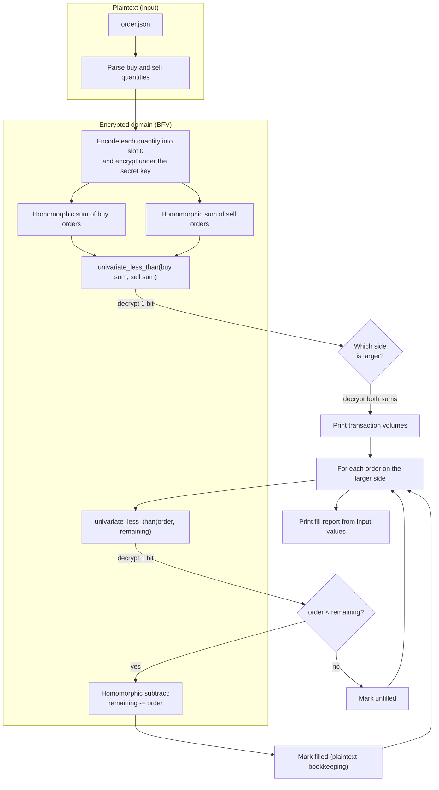

# BFV Homomorphic Order Matching Engine

Exchanges that see order flow can exploit it: front-running, information leakage from dark pool operators, and MEV extraction all stem from a matching engine that reads orders in the clear. This project explores the alternative, a matching engine written in Rust that performs its arithmetic (order aggregation, running volume, less-than comparisons) on BFV-encrypted order quantities, so the core matching computation never touches plaintext values.

One caveat up front, stated precisely in [What is encrypted and what is revealed](#what-is-encrypted-and-what-is-revealed): this is a single-party demonstration. Comparison results are decrypted at each decision point to drive control flow, so the process is not zero-knowledge end to end. The homomorphic circuits themselves (sums, subtraction, and a degree-65536 comparison polynomial) are real and tested.

## Quickstart

```sh
git clone https://github.com/Giri-Aayush/bfv-homomorphic-order-matching-engine.git
cd bfv-homomorphic-order-matching-engine/order-match-engine
cargo run --release
```

Requires a Rust toolchain with edition 2024 support (Rust 1.85 or later). Orders are read from `order-match-engine/order.json`:

```json
{
  "pair": "USDC/USDT",
  "buy_orders": [6, 6, 6, 6, 6, 6],
  "sell_orders": [1, 2, 3, 4, 5, 6]
}
```

The unit test for the homomorphic comparison circuit lives in `caird/operators`. It reads the precomputed coefficient file from `./data/less_than.bin`, so copy that file in before testing:

```sh
cp -r order-match-engine/data caird/operators/data
cd caird/operators && cargo test --release less_than_works
```

## What the engine does

The matching model is volume crossing on quantities, not a price-time-priority limit order book:

1. Each buy and sell quantity is encoded into slot 0 of its own BFV plaintext and encrypted.
2. The engine homomorphically sums all buy ciphertexts and all sell ciphertexts.
3. A homomorphic less-than compares the two encrypted sums. The single result bit is decrypted to learn which side has more volume.
4. Both aggregate sums are then decrypted and printed as the transaction volumes.
5. The engine walks the larger side's orders in input sequence. For each order it homomorphically compares the encrypted order against the encrypted remaining volume of the smaller side, decrypts the result bit, and if the order is strictly less than the remainder, homomorphically subtracts it from the remainder and marks the order filled.
6. The smaller side is filled entirely. Fill quantities are reported from the original input values.

With the sample `order.json` (buy sum 36, sell sum 21), the run fills buy orders 1 through 3 (18 units) and stops: order 4 is 6 and the remainder is 3, and the strict less-than also means an order exactly equal to the remainder would not fill. Partial fills are not supported.

## Architecture

Three crates, wired together by path dependencies:

| Crate | Path | Role |
| --- | --- | --- |
| `order-match-engine` | `order-match-engine/` | Binary. Parses `order.json`, runs the matching flow above. |
| `operators` | `caird/operators/` | Homomorphic comparison: `univariate_less_than`, `powers_of_x`, an encrypted `sort`, and the coefficient precomputation `compute_lt_coefficients`. |
| `bfv` | `bfv/bfv/` | The BFV scheme itself: RNS polynomial arithmetic, NTT (via `concrete-ntt`, optional Intel HEXL), encryption, relinearization, hybrid key switching. Vendored from Janmajaya Mall's `bfv` library (MIT license in `bfv/LICENSE`). |


```mermaid
flowchart TD
    subgraph P1["Plaintext (input)"]
        A[order.json] --> B[Parse buy and sell quantities]
    end

    B --> C["Encode each quantity into slot 0<br/>and encrypt under the secret key"]

    subgraph E["Encrypted domain (BFV)"]
        C --> D1["Homomorphic sum of buy orders"]
        C --> D2["Homomorphic sum of sell orders"]
        D1 --> F["univariate_less_than(buy sum, sell sum)"]
        D2 --> F
        G["univariate_less_than(order, remaining)"]
        H["Homomorphic subtract:<br/>remaining -= order"]
    end

    F -->|"decrypt 1 bit"| I{"Which side<br/>is larger?"}
    I -->|"decrypt both sums"| J["Print transaction volumes"]
    J --> K["For each order on the larger side"]
    K --> G
    G -->|"decrypt 1 bit"| L{"order < remaining?"}
    L -->|yes| H
    H --> M["Mark filled (plaintext bookkeeping)"]
    L -->|no| N["Mark unfilled"]
    M --> K
    N --> K
    K --> O["Print fill report from input values"]
```

Every decision the engine makes crosses the boundary out of the encrypted domain through a decryption of a single comparison bit. The quantities being compared and subtracted stay encrypted.

## How the cryptography works

**Library.** A vendored fork of [`Janmajayamall/bfv`](https://github.com/Janmajayamall/bfv), a from-scratch Rust implementation of the BFV scheme (Brakerski, Fan, Vercauteren) with RNS arithmetic, batching (SIMD slots), relinearization, Galois rotations, and hybrid key switching. It is not SEAL, OpenFHE, or `tfhe-rs`.

**Parameters** (set in `order-match-engine/src/main.rs`):

- Plaintext modulus t = 65537, a Fermat prime, so plaintext slots form Z_65537 and Fermat's little theorem applies with exponent 65536.
- Ring degree n = 16, so 16 SIMD slots. This is a toy dimension, see Limitations.
- Ciphertext modulus Q: ten 60-bit primes, about 600 bits total, plus a 180-bit extension modulus P for hybrid key switching.
- Encryption is symmetric key: the same `SecretKey` encrypts, and later decrypts, in one process. There is no public-key or multi-party setup.

**What runs homomorphically:**

- Additions and subtractions of ciphertexts (order sums, the running remainder).
- The less-than comparison, `univariate_less_than` in `caird/operators/src/lib.rs`. It computes z = x minus y, then evaluates the univariate sign-extraction polynomial over Z_t: the result is (t+1)/2 times z^(t-1) plus z times g(z^2), where g has degree (t-3)/2 and coefficients alpha_i equal to the sum of a^(t-1-i) for a from 1 to (t-1)/2. This is the univariate comparison construction of Iliashenko and Zucca ("Faster homomorphic comparison operations for BFV and TFHE"). The output ciphertext holds 1 in each slot where x < y and 0 otherwise, correct for inputs below t/2.
- The 32768 polynomial coefficients are precomputed by `compute_lt_coefficients` and shipped as `order-match-engine/data/less_than.bin` (262144 bytes of little-endian u64).
- Evaluation uses a baby-step giant-step split: powers z^2 through (z^2)^181 and ((z^2)^181)^1 through ((z^2)^181)^181, computed with a binary-exponentiation power ladder (`powers_of_x`) plus relinearization, then 182 blocks of 181 plaintext-multiply-and-accumulate steps.
- `operators` also contains an encrypted `sort` that builds a Hamming-weight matrix from pairwise comparisons and extracts ranked elements with an equality-test polynomial. The matching engine does not call it, and its test is commented out.

**What is decrypted, and when.** Three kinds of values leave the encrypted domain during a run:

1. One comparison bit per decision: first buy-sum versus sell-sum, then one per order on the larger side. Each is decrypted immediately so plaintext control flow can branch on it.
2. Both aggregate sums, decrypted and printed once the larger side is known.
3. Everything else, as demo scaffolding: the binary prints the raw input orders before encrypting them, and the final fill report copies quantities from the plaintext input vector rather than decrypting fill ciphertexts.

One more sharp edge: `univariate_less_than` takes the secret key as a parameter. It is only used by commented-out debug prints, but the signature means the comparison routine as written cannot be handed to an untrusted evaluator without refactoring.

## What is encrypted and what is revealed

An honest scorecard for the "zero plaintext" framing:

| Value | Encrypted during matching? | Revealed? |
| --- | --- | --- |
| Individual order quantities | Yes, all arithmetic on them is homomorphic | Yes, printed at startup and in the fill report (demo scaffolding, not required by the protocol) |
| Buy-side and sell-side totals | Yes, computed homomorphically | Yes, decrypted and printed after the side comparison |
| Comparison outcomes | Computed homomorphically | Yes, every result bit is decrypted to branch |
| Running unfilled remainder | Yes, updated by homomorphic subtraction | Only indirectly, through the comparison bits |
| Which orders filled | n/a (plaintext bookkeeping) | Yes, that is the output |

So the claim that holds is narrower than "zero plaintext": the arithmetic on order quantities is fully homomorphic, but the matching decisions leak one bit per comparison plus both aggregate sums, and the demo binary prints the inputs outright. In a deployment this decryption oracle would need to be a threshold-decryption committee or a party structurally separated from order flow. That machinery does not exist in this codebase.

## Measured performance

Measured on an Apple Silicon Mac (arm64), `--release`, at the toy ring degree n = 16:

- Full pipeline on the sample book (6 buys, 6 sells, 7 homomorphic comparisons): about 1.2 s wall clock, about 0.5 s CPU.
- `less_than_works` test (three comparison evaluations on fresh ciphertexts, each comparing all 16 slots at once): 0.23 s, roughly 75 ms per comparison.

These numbers do not transfer to secure parameters. Every polynomial operation scales at least with n log n, and a secure ring degree for a 600-bit modulus is three orders of magnitude larger than 16.

## Limitations

- **The parameters are insecure.** Ring degree 16 with a 600-bit ciphertext modulus offers no meaningful lattice security; standard estimates call for degrees in the tens of thousands at this modulus size. The library's own assertion floor is `degree >= 16` and this project runs at that floor. Treat every ciphertext in this repo as toy.
- **Not zero plaintext.** See the scorecard above: comparison bits and aggregate sums are decrypted mid-protocol, and the secret key lives in the matching process itself.
- **Quantities only, no prices.** Orders are bare u64 quantities. There is no price, no limit book, no time priority, and the `pair` field in `order.json` is parsed but unused.
- **Greedy, strict, no partial fills.** Orders on the larger side fill first-come against the remaining volume, the strict less-than leaves an order unfilled even when it exactly equals the remainder, and an order can only fill whole. The sample run matches 18 of 21 available units.
- **Console labels overstate.** The printed "Transaction Volume" is the larger side's total; the matched volume is bounded by the smaller total and can be lower still.
- **Input domain is bounded.** Comparison correctness requires values below t/2, about 32768, and the summed side must also stay below that bound. Slot capacity is not exploited by the engine: each order occupies one slot of a 16-slot ciphertext, although the comparison circuit itself is SIMD and the test exercises all 16 slots.
- **Depth budget is spent on comparison.** One `univariate_less_than` materializes two ladders of 181 powers each, one relinearized ciphertext multiplication per power, with a critical path of about eight squarings per ladder, all against a 10-prime modulus chain with no modulus switching in the call path. Fresh ciphertexts are used for each comparison; the code does not demonstrate chaining comparisons on comparison outputs.
- **No benchmarks for the engine.** The `bfv` library ships Criterion benches for its primitives, but the matching pipeline itself has no benches and only the one comparison unit test.
- **Not production software.** Single binary, `println!` everywhere, `expect` on I/O, secret key generated per run and never persisted, no serialization of ciphertexts (the `serialize` feature of the library is unused by the engine).

## Repository layout

```
order-match-engine/   binary crate: the matching flow, order.json, data/less_than.bin
caird/operators/      comparison and sorting circuits over BFV ciphertexts
bfv/                  vendored BFV library (workspace: bfv, traits), MIT licensed
```

## Credits

The `bfv` library and the comparison operator implementation build on work by Janmajaya Mall (`bfv/LICENSE`, MIT, 2023). The comparison polynomial follows Iliashenko and Zucca, "Faster homomorphic comparison operations for BFV and TFHE", PoPETs 2021.
